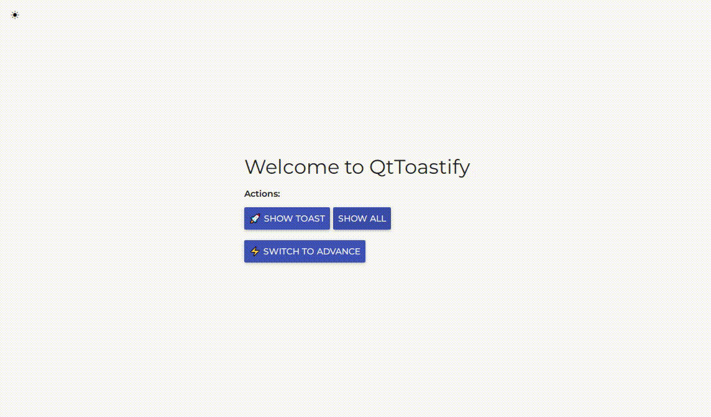
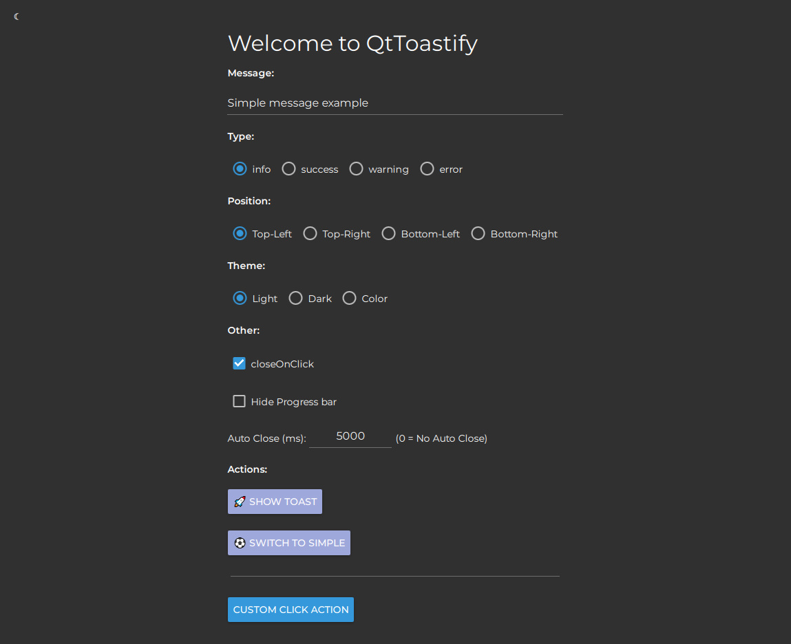

# Toastify-QML

A **QML-based Toast Notification Library** inspired by the popular [React-Toastify.js](https://www.npmjs.com/package/react-toastify) library. Toastify-QML provides customizable, animated toast notifications for **Qt/QML** applications.

---

## Preview 🖼️

### Light Theme (Simple view)


### Dark Theme (Advanced view)


---

## Features 🚀

- **Multiple Positions**: Display toasts at Top-Left, Top-Right, Bottom-Left, or Bottom-Right corners.
- **Customizable Themes**: Support for Light, Dark, and Color themes.
- **Toast Types**: Different types such as `info`, `success`, `warning`, and `error` with accent colors.
- **Auto-Close Support**: Automatically close notifications after a specified duration.
- **Progress Bar**: A sleek progress bar indicating auto-close countdown.
- **Animations**: Smooth **enter** and **exit** animations.
- **Click Actions**: Handle user clicks with custom actions.

---

## Files 📂

The project contains the following key files:

1. **Toastify.qml**: The main toast manager that positions and displays notifications.
2. **ToastifyDelegate.qml**: Represents an individual toast notification with animations and styles.

---

## Setup & Usage ⚙️

### Step 1: Integrate Toastify in Your Project

Place the following files into your QML project directory:

- `Toastify.qml`
- `ToastifyDelegate.qml`
- Required icon assets (e.g., `info.svg`, `success.svg`, etc.)

Add the files to your `resources.qrc` file if needed.

---

### Step 2: Load Toastify.qml

Load the `Toastify` component in your root QML file:

```qml
import QtQuick 2.15
import QtQuick.Controls 2.15

ApplicationWindow {
    visible: true
    width: 800
    height: 600
    title: "Toastify-QML Demo"

    // Add Toastify Component
    Toastify {
        id: toastManager
    }

    Button {
        text: "Show Toast"
        anchors.centerIn: parent
        onClicked: {
            toastManager.createMessage("This is a success message!", {
                type: "success",
                position: Qt.TopRightCorner,
                theme: "Light",
                autoClose: 5000,
                hideProgressBar: false,
                clickAction: function() { console.log("Toast clicked!") }
            });
        }
    }
}
```

---

### Step 3: Create Toast Notifications

To display a toast message, call the `createMessage()` function with the message and options:

#### Function Signature

```javascript
createMessage(message, options = {})
```

#### Example Usage

```qml
toastManager.createMessage("Data saved successfully!", {
    type: "success",
    position: Qt.BottomRightCorner,
    theme: "Dark",
    autoClose: 3000,
    hideProgressBar: false
});
```

---

## Options 🔧

The `options` parameter allows you to customize the toast:

| **Option**           | **Type**      | **Default**        | **Description**                                           |
|-----------------------|---------------|--------------------|-----------------------------------------------------------|
| `type`               | `string`      | `"info"`           | Type of toast (`info`, `success`, `warning`, `error`).    |
| `position`           | `Qt.Corner`   | `Qt.TopLeftCorner` | Position of the toast on the screen.                     |
| `theme`              | `string`      | `"Light"`          | Theme for the toast (`Light`, `Dark`, `Color`).          |
| `autoClose`          | `int`         | `5000`             | Duration to auto-close the toast (0 means no auto-close).|
| `closeOnClick`       | `bool`        | `true`             | Whether to close the toast on click.                     |
| `hideProgressBar`    | `bool`        | `false`            | Hide or show the progress bar.                           |
| `clickAction`        | `function`    | `null`             | Custom action on toast click.                            |

---

## Themes 🎨

Toastify supports the following themes:

1. **Light**: A clean white background with black text.
2. **Dark**: A sleek dark theme with white text.
3. **Color**: The toast background uses the accent color based on the type (`info`, `success`, `warning`, `error`).

---

## Animations 🎬

Toastify-QML uses smooth animations for entering and exiting toasts:

- **Enter Animation**: Slides into position with a bounce-back effect.
- **Exit Animation**: Slides out of view with a smooth easing effect.

---

## Progress Bar 📊

The optional progress bar provides a visual cue for the auto-close countdown.

- **Enabled** by default if `autoClose` > 0.
- Can be **hidden** using `hideProgressBar: true`.

---

## License 📜

This project is licensed under the **MIT License**.

---

## Author 👨‍💻

Developed by Mehran from mastercom© team with inspiration from the **React-Toastify.js** library.
Feel free to check out our gigs on [fiverr](https://www.fiverr.com/mastercom_co), for your QML needs 😉

---

## Contributions 🤝

Contributions are welcome! Feel free to submit issues or pull requests.